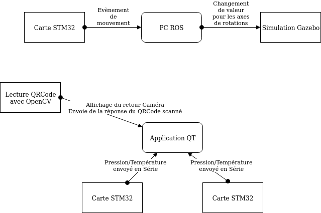

<h1>Projet Domotique</h1>

__Projet:__

    -Le but de ce projet d’intégration est de développer une solution domotique s’appuyant sur
    les compétences acquises ce semestre.

    -Cette solution doit mesurer la température et pression dans au moins deux pièces et
    proposer un affichage de ces valeurs pour chaque pièce.

    -Cette solution doit afficher un flux vidéo (de la porte d’entrée) à la demande. En cas de
    présentation d’un QR code, la porte s’ouvre (simulé).

## 1. Sources

Image domotique: récupéré depuis le pdf du sujet.

Code QRcode: [Lien](https://blog.mafrog.info/lelectronique/raspberry-pi/lecture-de-code-a-barre-et-qr-code-avec-opencv-et-zbar-sur-raspberry-pi/)

Code STM32: [Lien](https://os.mbed.com/platforms/ST-Nucleo-L476RG/)

## 2. Logiciel utilisés

Gestion de projet: GitLab 

Scrum: framemo [Lien](https://framemo.org/ouscrm)

Programmation application graphique: QT Creator

Programmation STM32: Mbed

Programmation ROS: Gazebo

## 3. Matériels utilisés

3 cartes STM32 NUCLEO L476RG + 3 shields X-NUCLEO-IKS01A3, un PC tour HP, ordinateur portable.

## 4. Travail à effectuer

    1. Installation du master ROS sur la tour HP
    2. Un interface graphique en Qt, présentant :
        a. la température et la pression pour au moins deux pièces
    3. Traitement du flux vidéo de la caméra afin d'ouvrir la porte d'entrée par
    présentation d'un QR code
        a. intégrer à l'interface graphique la simulation de porte d’entrée avec
        deux états : ouvert et fermé
    4. Une simulation de détection d’ouverture de la porte sur Gazebo activée par
    les mouvements d’une Nucléo.

## 5. Installation

Récupérer sur la branch master les dossiers:

    -Domotique_Client_Integrated
    -Ros_System
    -STM32

Pour commencer on met le programme __Temp_Press.bin__ qui se trouve dans __STM32/BUILD/...__ dans les cartes NUCLEO,
pour cela il faut brancher les carte sur l'ordianteur et envoyer le fichier .bin sur les périphérique des cartes.
Ne pas oublier de changer le nom de chaque carte dans le __main.cpp__ puis recompiler avec __make__ et retéléverser le .bin dans la carte correspondante pour le bon fonctionnement du programme QT.

Ensuite on ouvre avec QT Creator le fichier __../Domotique_Client_Integrated/Domotique_Client.pro__
On lance le programme et la fenêtre de reception des capteur de temperature et de pression des carte s'ouvre.

Pour avoir les images il faut modifier le chemin qui se trouve dans le __main.cpp__.

Si un problème avec __"zbar"__ survient ajouter la librairie à l'aide de la commande suivante: __sudo apt-get install libzbar-dev__

puis relancer l'application, utilisez le QR code donné dans le git pour l'ouverture de la porte.

Pour __ROS__ , même chose pour la carte NUCLEO, on prends le fichier __../STM32/Accelerometre/BUILD/Accelerometre.bin__ et on le téléverse dans la carte.
Allez dans le dossier __Ros_System__, on ouvre un terminal depuis le dossier et on fait __"source devl/setup.bash"__, on autorise l'écoute du port série avec la commande __"sudo chmod 666 /dev/ttyACM0"__,
ensuite on fait la commande __"roslaunch repository launch.launch"__ puis Gazebo s'ouvre on peut voir une porte modélisé en 3D, bougez la carte STM32 et la porte s'ouvre.
...

## 6. Structure

## 7. Conclusion

__Fonctionel:__

    -Lecture de la temperature et de la pression à partir des cartes STM32, 
    -Affichage de ses données sur l'intergface graphique, 
    -Detection du QR code,
    -Mise à jour du status de la porte en temps réel, 
    -Simulation de l'ouverture de la porte en 3d sur Gazebo a partir d'un mouvement sur la carte STM32.

__Amélioration:__

    -Integration de test unitaire avec QTest,
    -Liaison entre l'application QT et l'environnement ROS pour l'ouverture de la porte,
    -Crée un éxecutable portable,
    -Permetre la visualitation des images sans modifié le code source avec un fichier de configuration.

## 8. Vidéo

__Programme QT__

__Programme ROS__
